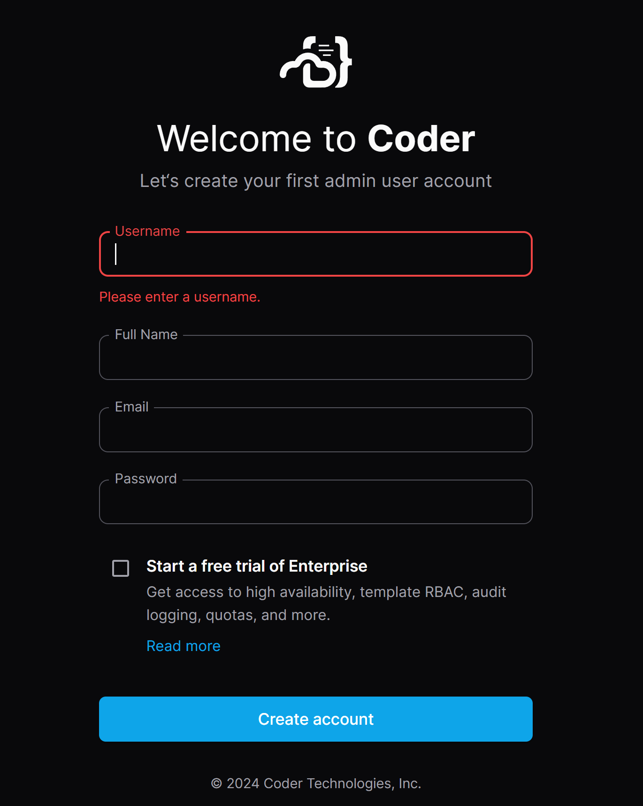
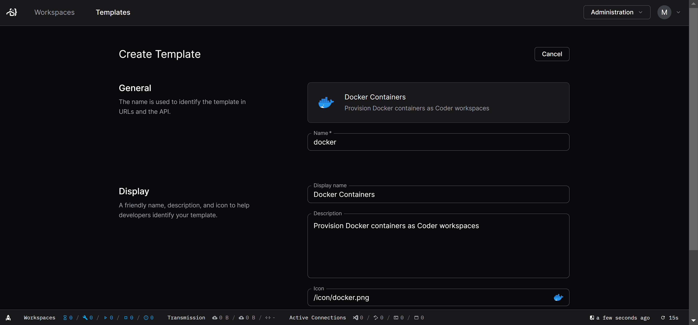
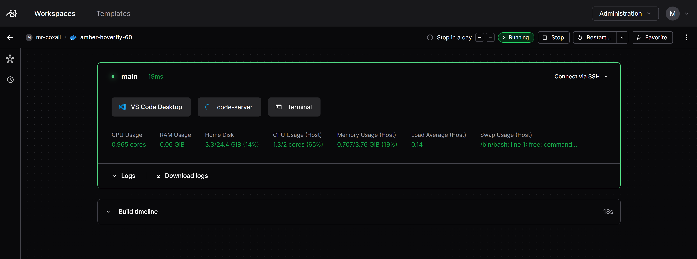
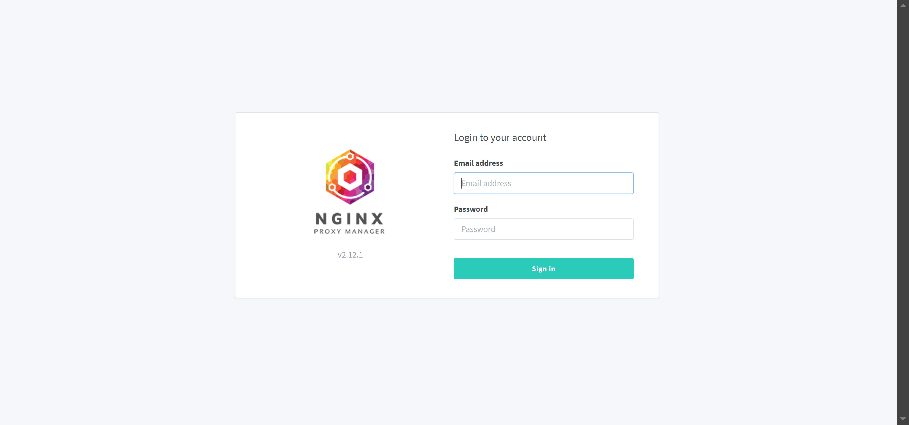

# Coder Servers running in Docker on AWS

- These are the steps to get multiple Coder IDE Servers up and running on an AWS EC2 machine, using docker and Nginx Proxy Manager and your own domain names.

## AWS EC2 Security Group
- create a new security group with SSH, HTTP, HTTPS & 9443 (for portainer) access
- 

## AWS EC2 Instance
- create an EC2 instance
  -  Debian
  -  Architecture - 64-bit (Arm) <- I pick this because it is cheaper
  -  Instance type - t4g.medium (could be smaller or larger)
  -  use your existing or create a key pair (to SSH into machine)
  -  Network settings - Select existing security group and pick the one you created above
  -  Configure storage - the amount you want
 
## AWS EC2 Elastic IPs
- create a new elastic IP, so you have a static IP address
  - Allocate Elastic IP address
  - Associate you your instance
  - 

## Connect to EC2 Instance
- ssh into your instance
  - 
- ``` BASH
  sudo apt update
  sudo apt upgrade -y
  ```

## Install Docker
- install docker onto the instance
  - see: https://docs.docker.com/engine/install/debian/
- ``` BASH
  sudo apt-get update
  sudo apt-get install ca-certificates curl
  sudo install -m 0755 -d /etc/apt/keyrings
  sudo curl -fsSL https://download.docker.com/linux/debian/gpg -o /etc/apt/keyrings/docker.asc
  sudo chmod a+r /etc/apt/keyrings/docker.asc

  echo \
    "deb [arch=$(dpkg --print-architecture) signed-by=/etc/apt/keyrings/docker.asc] https://download.docker.com/linux/debian \
  $(. /etc/os-release && echo "$VERSION_CODENAME") stable" | \
  sudo tee /etc/apt/sources.list.d/docker.list > /dev/null
  sudo apt-get update

  sudo apt-get install -y docker-ce docker-ce-cli containerd.io docker-buildx-plugin docker-compose-plugin

  sudo docker run hello-world
  ```

## Install Portainer CE (Community Edition)
- install portainer
  - https://docs.portainer.io/start/install-ce/server/docker/linux
- ``` BASH
  sudo docker volume create portainer_data
  sudo docker run -d -p 8000:8000 -p 9443:9443 --name portainer --restart=always -v /var/run/docker.sock:/var/run/docker.sock -v portainer_data:/data portainer/portainer-ce:2.21.4
  ```
- login to portainer (https://xx.xx.xx.xx:9443)
  - where xx.xx.xx.xx = Elastic IP
  - accept that the connection has a "self-signed certificate"
  - create a user with password

## Add a Coder Stack
- install a Coder docker compose file (stack)
  - https://coder.com/docs/install/docker
  - NOTES: for the Coder service change the outside port to a different number than all you other Coder docker instances ex: "1001:7080". You might want to set it to "80" just for now so you can test to ensure everything is working. You will also need to find out the "docker group ID". For AWS it is most likely 994.
  - ``` BASH
    version: "3.9"
    services:
      coder:
        # This MUST be stable for our documentation and
        # other automations.
        image: ghcr.io/coder/coder:${CODER_VERSION:-latest}
        # restart automatically
        restart: unless-stopped
        ports:
          - "80:7080"
        environment:
          CODER_PG_CONNECTION_URL: "postgresql://${POSTGRES_USER:-username}:${POSTGRES_PASSWORD:-password}@database/${POSTGRES_DB:-coder}?sslmode=disable"
          CODER_HTTP_ADDRESS: "0.0.0.0:7080"
          # You'll need to set CODER_ACCESS_URL to an IP or domain
          # that workspaces can reach. This cannot be localhost
          # or 127.0.0.1 for non-Docker templates!
          CODER_ACCESS_URL: "${CODER_ACCESS_URL}"
        # If the coder user does not have write permissions on
        # the docker socket, you can uncomment the following
        # lines and set the group ID to one that has write
        # permissions on the docker socket.
        group_add:
          - "994" # docker group on host
        volumes:
          - /var/run/docker.sock:/var/run/docker.sock
        depends_on:
          database:
            condition: service_healthy
      database:
        # Minimum supported version is 13.
        # More versions here: https://hub.docker.com/_/postgres
        image: "postgres:16"
        # restart automatically
        restart: unless-stopped
        ports:
          - "5432:5432"
        environment:
          POSTGRES_USER: ${POSTGRES_USER:-username} # The PostgreSQL user (useful to connect to the database)
          POSTGRES_PASSWORD: ${POSTGRES_PASSWORD:-password} # The PostgreSQL password (useful to connect to the database)
          POSTGRES_DB: ${POSTGRES_DB:-coder} # The PostgreSQL default database (automatically created at first launch)
        volumes:
          - coder_data:/var/lib/postgresql/data # Use "docker volume rm coder_coder_data" to reset Coder
        healthcheck:
          test:
            [
              "CMD-SHELL",
              "pg_isready -U ${POSTGRES_USER:-username} -d ${POSTGRES_DB:-coder}",
            ]
          interval: 5s
          timeout: 5s
          retries: 5
    volumes:
      coder_data:
    ```

## Coder Setup
- login to Coder
  - http://xx.xx.xx.xx:80 (if you set port to 80)
- 
- pick an Admin user login and password
- create a "docker template", to ensure you have the correct docker group id
-  
-  then create a workspace to ensure everything is OK
-  

## Install Docker Nginx Proxy Manager Stack
- before starting, change the port for Coder to not be on 80 any more (since Nginx will be using it)
- create a stack for Nginx Proxy Manager
  - https://nginxproxymanager.com/setup/
- ```BASH
  version: '3.8'
  services:
    app:
      image: 'jc21/nginx-proxy-manager:latest'
      restart: unless-stopped
      ports:
        # These ports are in format <host-port>:<container-port>
        - '80:80' # Public HTTP Port
        - '443:443' # Public HTTPS Port
        - '81:81' # Admin Web Port
        # Add any other Stream port you want to expose
        # - '21:21' # FTP

      # Uncomment the next line if you uncomment anything in the section
      # environment:
        # Uncomment this if you want to change the location of
        # the SQLite DB file within the container
        # DB_SQLITE_FILE: "/data/database.sqlite"

        # Uncomment this if IPv6 is not enabled on your host
        # DISABLE_IPV6: 'true'

      volumes:
        - ./data:/data
        - ./letsencrypt:/etc/letsencrypt
    ```
  - confirm you can login
    - http://xx.xx.xx.xx🈲
  - the defaults are:
    - Email: admin@example.com
    - Password: changeme
  - 
  - change the default user and the password
