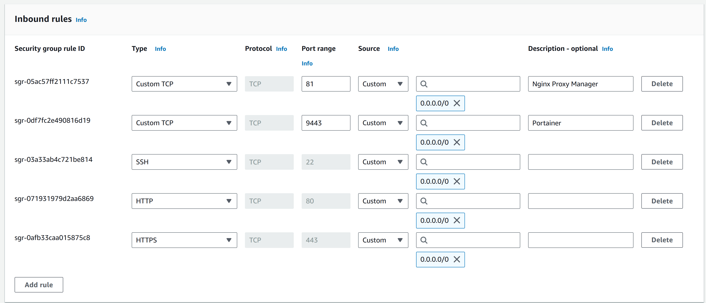

# Coder Servers running in Docker on AWS

- These are the steps to get multiple Coder IDE Servers up and running on an AWS EC2 machine, using docker and Nginx Proxy Manager and your own domain names.

## AWS EC2 Security Group
- create a new security group with SSH, HTTP & HTTPS access
- 

## AWS EC2 Instance
- create an EC2 instance
  -  Debian
  -  Architecture - 64-bit (Arm) <- I pick this because it is cheaper
  -  Instance type - t4g.medium (could be smaller or larger)
  -  use your existing or create a key pair (to SSH into machine)
  -  Network settings - Select existing security group and pick the one you created above
  -  Configure storage - the amount you want
 
## AWS EC2 Elastic IPs
- create a new elastic IP, so you have a static IP address
  - Allocate Elastic IP address
  - Associate you your instance
  - 

## Connect to EC2 Instance
- ssh into your instance
  - 
- ``` BASH
  sudo apt update
  sudo apt upgrade -y
  ```

## Install Docker
- install docker onto the instance
  - see: https://docs.docker.com/engine/install/debian/
- ``` BASH
  sudo apt-get update
  sudo apt-get install ca-certificates curl
  sudo install -m 0755 -d /etc/apt/keyrings
  sudo curl -fsSL https://download.docker.com/linux/debian/gpg -o /etc/apt/keyrings/docker.asc
  sudo chmod a+r /etc/apt/keyrings/docker.asc

  echo \
    "deb [arch=$(dpkg --print-architecture) signed-by=/etc/apt/keyrings/docker.asc] https://download.docker.com/linux/debian \
  $(. /etc/os-release && echo "$VERSION_CODENAME") stable" | \
  sudo tee /etc/apt/sources.list.d/docker.list > /dev/null
  sudo apt-get update

  sudo apt-get install -y docker-ce docker-ce-cli containerd.io docker-buildx-plugin docker-compose-plugin

  sudo docker run hello-world
  ```
